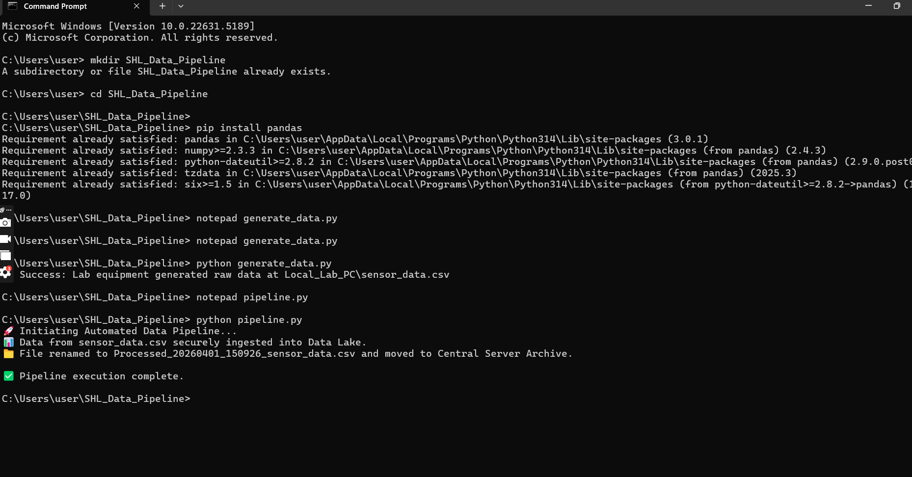

# Automated Lab Data Pipeline & Data Lake Simulator
**Built by: Haris Khan**

## Project Overview
This project simulates a secure, automated data bridge between local laboratory equipment and a centralized server, adhering to **ALCOA+ Data Integrity** principles. It was designed to replace manual USB data transfers with automated, structured data paths.

## Core Capabilities Developed
* **Data Automation (Windows-Based):** Utilized Python (`os`, `shutil`) to automate the extraction, transfer, and archival of raw CSV data from a simulated local instrument.
* **Metadata Tagging & Lineage:** Implemented logic to automatically append processing timestamps and original source-file tags to ensure full data traceability.
* **Data Lake Integration:** Engineered a pipeline using `pandas` and `sqlite3` to securely ingest experimental data into a structured relational database.
## Execution Output

